## email 수집
## 각자 이메일로 kimdypm@gmail.com 으로 git 추가 요청 이라는 제목으로 보내주세요

## github 가입
https://github.com/openjdk/ 를 follow 합니다.

## java 다운로드
https://openjdk.org/
https://openjdk.org/projects/jdk/
https://openjdk.org/install/
https://jdk.java.net/java-se-ri/17-MR1
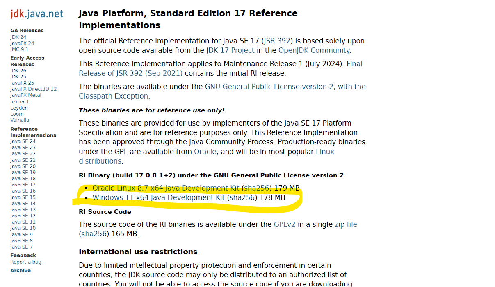
## 다운로드 시간 오래 걸리니, 기타 다음 내용도 보시고, 설치
## 압축해제 하면
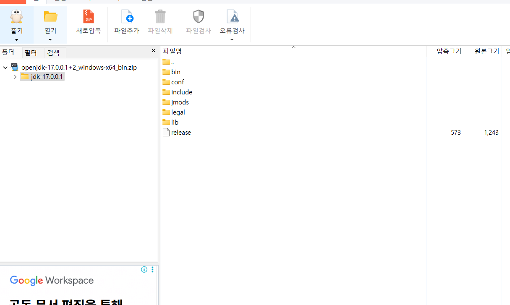
## 압축해제 디렉토리명을 심플하게 만들고 c:\ 에 디렉토리 통째 복사
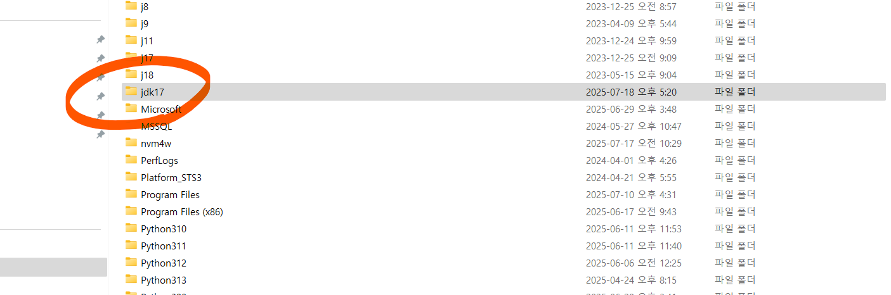
## 실행 설정을 위한 윈도우즈 -> 시스템 -> 설정
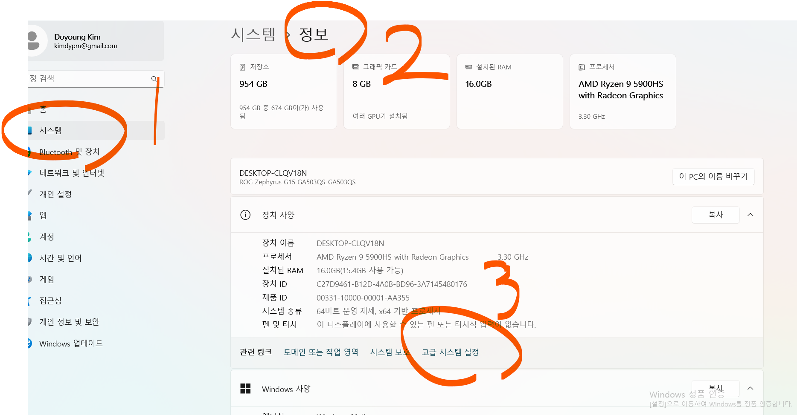
## 고급설정
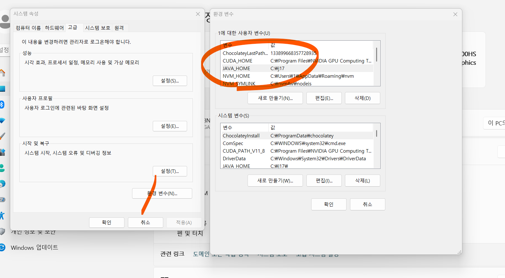
## JAVA_HOME , path 에 추가
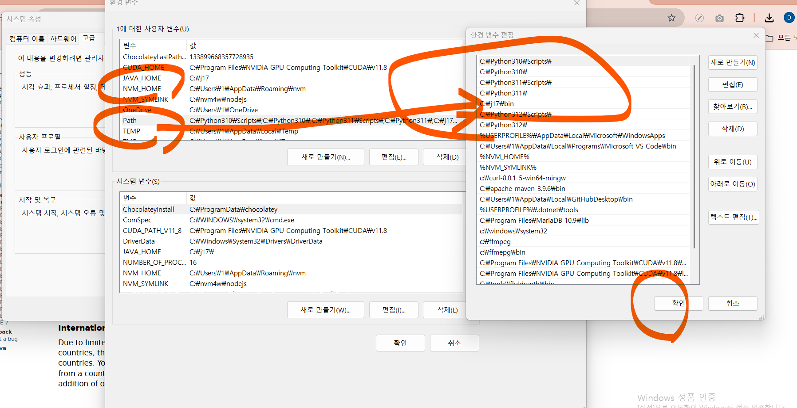
## 시스템 변수에도 동일 적용
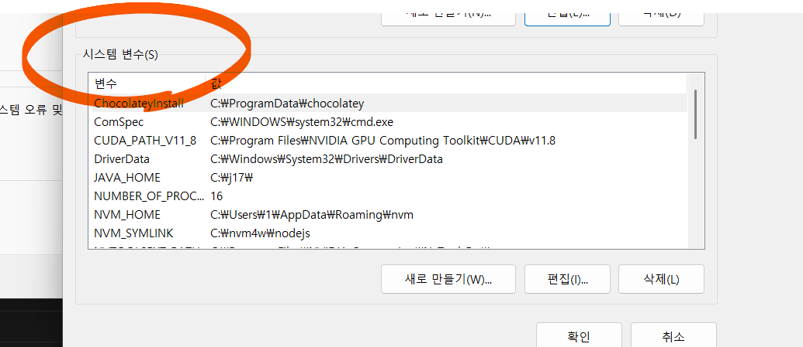

## git 설치
## https://git-scm.com/book/ko/v2/%EC%8B%9C%EC%9E%91%ED%95%98%EA%B8%B0-Git-%EC%84%A4%EC%B9%98
https://git-scm.com/downloads/win
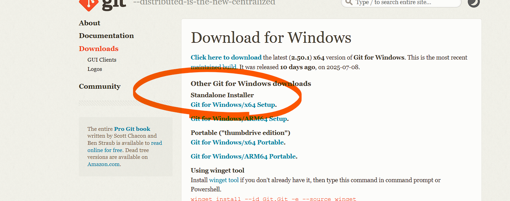
## 64비트
## 윈도우즈 버젼 설치
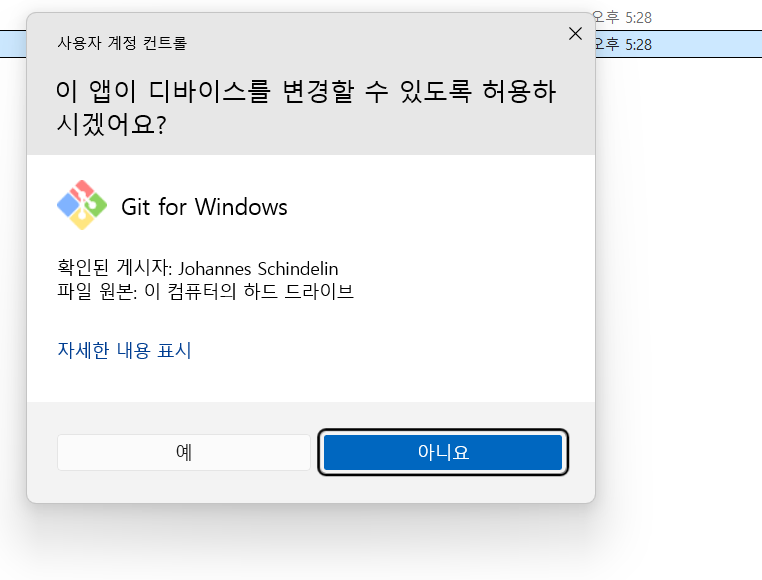

## vscode 설치
## https://code.visualstudio.com/download
## 64비트 다운로드 및 설치 실행
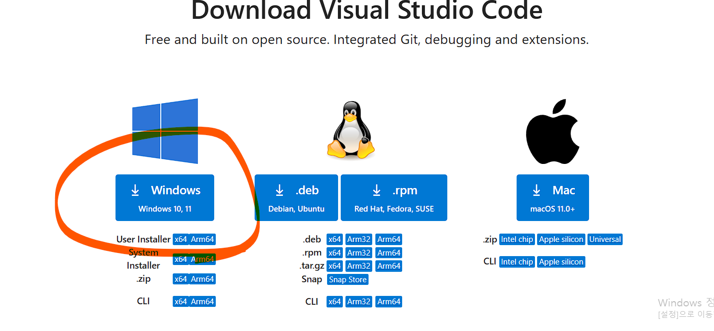

## VSCode 재 실행 후
터미날 -> 새 터미날

## 다음 명령 실행
## java --version
openjdk 17.0.9 2023-10-17
OpenJDK Runtime Environment Temurin-17.0.9+9 (build 17.0.9+9)
OpenJDK 64-Bit Server VM Temurin-17.0.9+9 (build 17.0.9+9, mixed mode, sharing)
## git --version
git version 2.47.1.windows.2

## source 를 git clone 한뒤 다음과 같이 우측 상단의 run java 실행
## 초대 받은 사람 이메일로 수락 후
https://github.com/edumgt/java-education-001.git
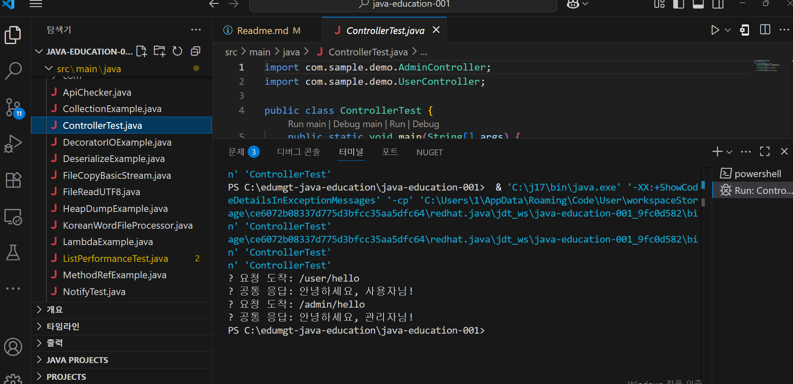

## 각 git repo 만들기
## 해당 repo clone
## Readme.md 파일 만들어서 MD 파일 답게 간단히 입력